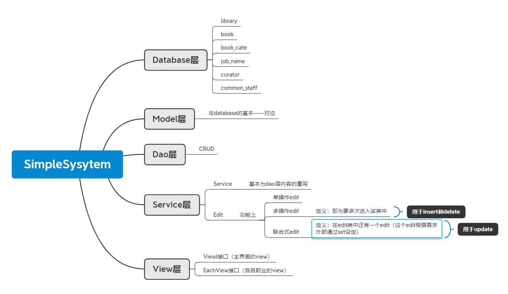
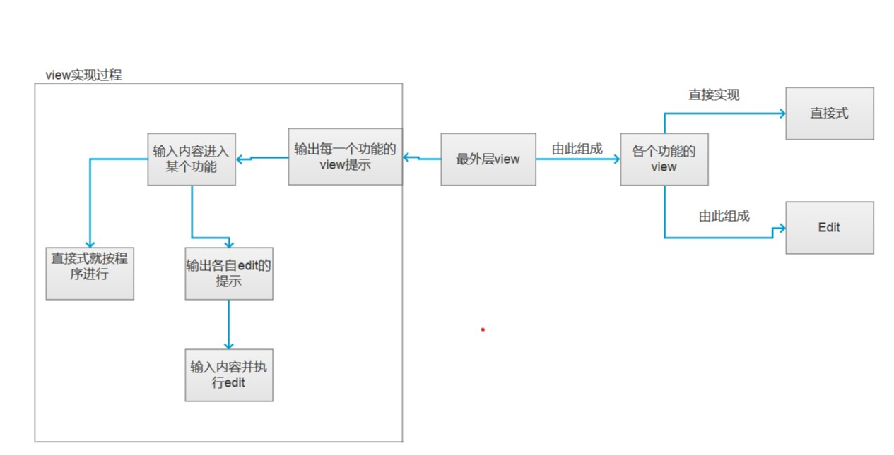

* 项目简介

  ​	普通职员和馆长的图书管理系统，可以进行登录，注册操作，以及各自职员的系统

* 功能特性

  * 普通职员可以修改书本的借出量和余有量
  * 馆长可以查看所有职员基本信息，删除和授权员工，以及普通职员的功能

* 使用：

  * 在java编译器上对MainView类中的mian在控制台上执行即可

* 内容更新

  * 后续还可添加两个新的职业总管理员和书籍类型管理员
  * 再次细化功能

* 现有缺陷：

  * 图书没有与图书馆相匹配

* 代码实现主要内容

  *  整体内容：

    ###### 

  * #### view的实现

    

  * edit的属性：

    * nowProcess是在view中用于输出当下操作的

  * edit的使用：（实现edit接口的类）

    * 各个职员的注册---每一步对应一个edit（多个不同类型）（将内容写入hashmap中，进入edit将输入内容进行设置，后通过该map建立新对象通过dao写入表中）
    * 注册User，新建book，library（单一类型）---每一步对应一个edit（每一个edit中将传入的对象进行设置，最终通过dao进行实现）
    * 信息的更新 --联合式（第一个类获取了信息后将内部另一个edit中的nowProcess修改得以将获取内容输出）
    * 删除内容--多操作式（抛出异常使得回到该类）用editTime在每次进入完成操作后将editTime++，不同的editTime不同的操作

    

